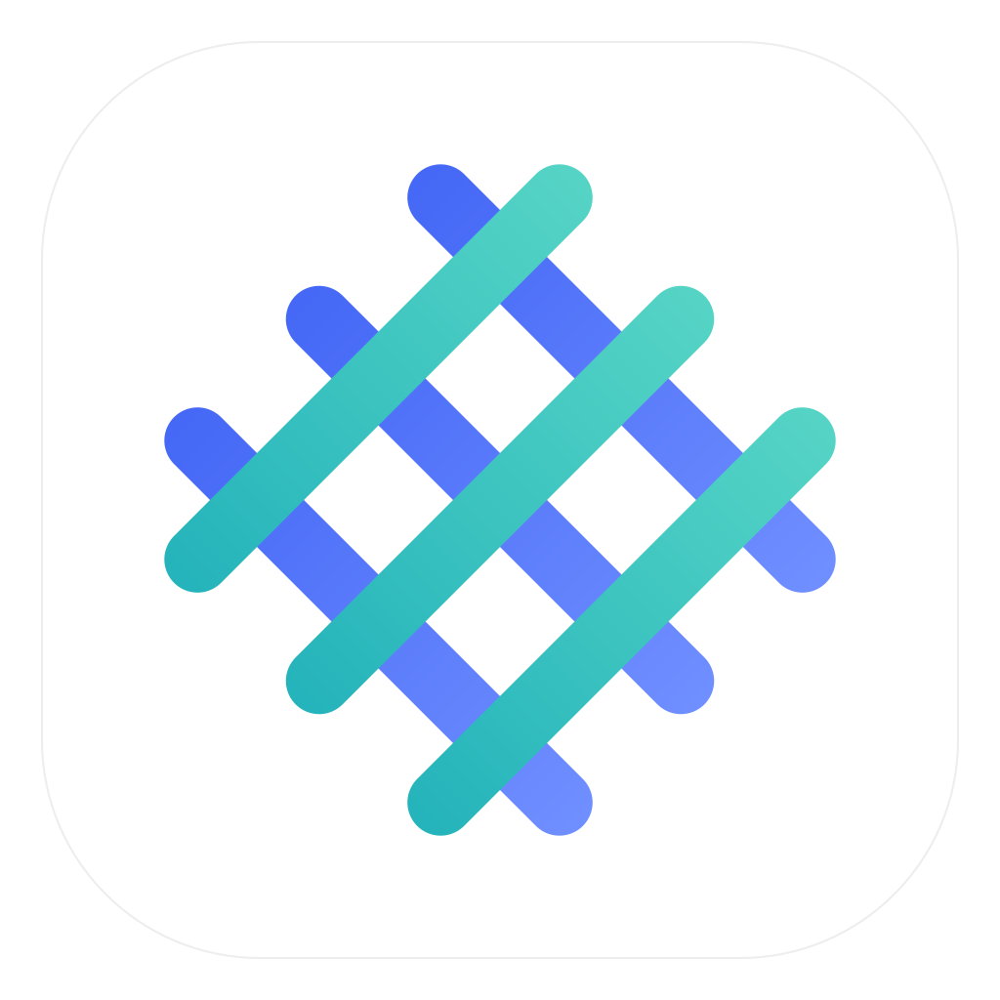
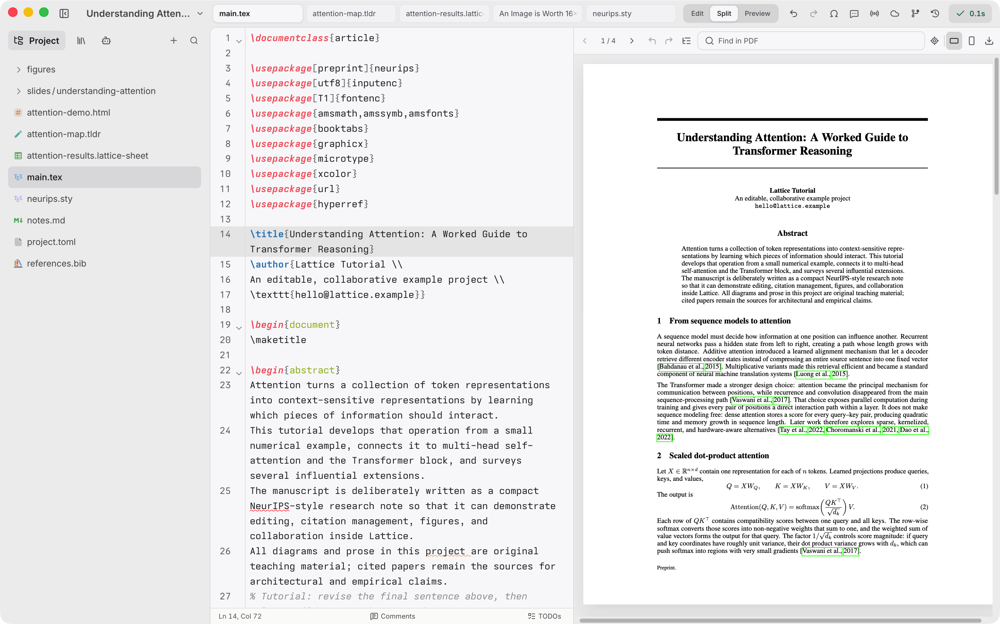

<div align="center">



# Lattice

**A local research workspace for writing, reading, thinking, and collaborating.**

Lattice brings LaTeX, visual notes, whiteboards, papers, version history,
collaboration, and an AI research agent together in one macOS app.

[](https://github.com/leo1oel/lattice/releases/latest)
[](https://github.com/leo1oel/lattice/releases/latest)
[](LICENSE)

[**Download for macOS**](https://github.com/leo1oel/lattice/releases/latest) ·
[Get started](#get-started) ·
[Explore the features](#one-workspace-for-the-whole-research-process) ·
[Get help](https://github.com/leo1oel/lattice/issues)

</div>

---

**Lattice is a desktop LaTeX editor and compiler for macOS, wrapped in the rest
of the work a paper actually takes.** It is for researchers, PhD students and
anyone else who writes papers in LaTeX and is tired of the writing living in one
tool, the reading in another, the figures in a third, and the collaboration in a
fourth.

Research rarely happens in a single editor. A paper moves between LaTeX,
PDFs, notes, sketches, references, collaborators, Git, and increasingly AI.
Lattice keeps that work connected without taking it away from your computer or
turning your manuscript into a proprietary document.

Around the LaTeX editor sits a Notion-like Markdown editor, visual whiteboards,
literature management, realtime collaboration (Lattice's own, or Overleaf's),
project history, and an AI agent that can see the project you are working on.
Everything is a real file in a real folder on your Mac.

<!--
================================ SCREENSHOTS ================================
Not captured yet. This whole block is commented out on purpose — a broken image
in a README looks worse than no image at all.

TO PUBLISH: create `docs/images/`, add the files named below, then delete this
whole instruction block plus the two comment-delimiter lines that wrap it (the
opening one above these instructions and the closing one after the markup at the
bottom). Nothing else needs to change.

WHAT TO CAPTURE — four shots, in this priority order:

  1. lattice-hero.png        THE one that matters. Editor + live PDF side by
                             side on a real-looking paper: two-column article,
                             a numbered equation, a figure, a \cite in the
                             visible text. Outline panel open on the left. This
                             is what a visitor judges the project on.
  2. lattice-agent.png       Agent panel open beside the editor, mid-answer,
                             with a passage selected in the source so the
                             "it can see my document" point lands visually.
  3. lattice-papers.png      Library view: several imported papers, a cached
                             paper open, the citation picker visible.
  4. lattice-collab.gif      6-10s loop: two cursors editing the same .tex,
                             remote cursor labelled, PDF recompiling. A GIF
                             earns its bytes here and nowhere else.

HOW TO CAPTURE:

  - Window: resize to 1440x900 logical points, on a Retina display, so the PNG
    lands at 2880x1800. GitHub renders the README at roughly 880px wide, so 2x
    stays crisp without being enormous.
  - Capture the window, not the screen: Cmd+Shift+4 then Space, then click the
    window. Hold Option while clicking to drop the drop-shadow (preferred —
    the shadow wastes ~40px of margin on every side).
  - Hide anything personal first: no menu bar, no Dock, no desktop.
  - Light mode for every still. Then, if you want dark too, capture the same
    frame in dark mode as `*-dark.png` and use the <picture> pattern below;
    GitHub honours prefers-color-scheme.

WHAT TO REDACT — check every shot before committing:

  - your real name, email, and macOS account name (they appear in the window
    title path, in collaboration presence, and in Git history panels);
  - collaborator names and avatars — use two accounts you own;
  - unpublished manuscript text. Use a conference template or a published
    preprint of your own, never work in progress;
  - Overleaf project names and any Settings screen (it holds API keys and the
    collaboration sync host);
  - absolute paths containing /Users/<you>/.

FILE SIZE: keep each PNG under ~800 KB and the GIF under ~4 MB. `pngquant` and
`gifsicle -O3 --lossy=80` both help. Do NOT commit anything from `video/out/` —
that render is 175 MB and is gitignored for a reason. If you want the full promo
video in the README, upload it as a release asset or drag it into a GitHub issue
and link the resulting URL.

========================== BLOCK TO UNCOMMENT ==============================

<div align="center">

<picture>
  <source media="(prefers-color-scheme: dark)" srcset="docs/images/lattice-hero-dark.png" />
  
</picture>

<em>LaTeX source and the compiled PDF, side by side, with the document outline.</em>

</div>

|  |  |
| --- | --- |
|  |  |
| **Ask about the passage you selected.** The agent reads the active document, your selection, and your imported papers. | **Papers and citations in one place.** Import from arXiv, read cached snapshots, insert the citation. |

<div align="center">


<em>Realtime collaboration: live cursors, comments, and a PDF that keeps up.</em>

</div>

============================ END OF BLOCK ==================================
-->

## One workspace for the whole research process

### ✍️ Write papers, notes, and ideas side by side

Edit LaTeX with completion and diagnostics while the PDF updates beside your
source. Jump between source and output with SyncTeX, search and annotate the
PDF, and export it when it is ready.

Research does not begin and end in LaTeX, so the same project can also hold
rich Markdown notes, diagrams, and free-form whiteboards. Use them for reading
notes, outlines, derivations, figures, or early ideas without opening a second
workspace.

### 👥 Collaborate with Lattice or Overleaf

Share a Lattice project for realtime editing, cursors, comments, project chat,
and shared assets. Every collaborator keeps a working copy of the project on
their own computer.

Already working with an Overleaf team? Open and sync Overleaf projects from
Lattice, collaborate through Overleaf's live channel, and work with comments,
chat, tracked changes, and project history without abandoning your existing
workflow.

### 🕘 See how the project changed

Built-in Git support keeps the evolution of a paper visible. Browse history,
inspect file-level changes, compare revisions, and restore earlier work from
inside the app. Agent edits are also reviewable and backed by checkpoints, so
experimentation does not have to mean losing a good draft.

### 🤖 Work with an AI research agent

Ask questions without repeatedly pasting your manuscript into a chat window.
The agent can work with the active document, selected text, imported papers,
and build context. Use it to explore an idea, understand a source, improve a
passage, or make reviewable changes across the project.

You choose the provider, model, tools, and permission mode from the Agent
settings in Lattice.

### 📚 Manage citations and papers together

Keep references and reading material in one library instead of separating the
`.bib` file from the papers it describes. Import work from arXiv, search related
literature, read cached paper snapshots, preview references, and insert
citations while writing.

Lattice connects the citation in your manuscript to the paper you want to
understand, making literature review and writing part of the same workflow.

## Get started

Official builds currently support **Apple Silicon Macs running macOS 14 or
later**. Downloads are signed and notarized by Apple and update automatically.

1. **[Download the latest release](https://github.com/leo1oel/lattice/releases/latest)**,
   open the DMG, and drag Lattice into Applications.
2. Install a TeX distribution that provides `latexmk`. On first launch,
   Lattice checks your local TeX setup and helps identify missing tools.
3. Choose **New project** to start from a conference template, **Open folder**
   for an existing LaTeX project, or open a project from Overleaf.
4. Press `Cmd+S` to save and compile. The editor and PDF preview stay together
   as you write.

From there, try the workflow that matches your project:

- Add a Markdown note or whiteboard for planning and reading notes.
- Import an arXiv URL to add a paper and citation to your library.
- Select a passage before asking the agent a question to give it precise context.
- Open **Live collaboration** to share with another Lattice user.
- Connect Overleaf to bring an existing collaborative project into Lattice.
- Open **History** to review or restore earlier changes.

Lattice updates itself. What changed in each version is on the
[releases page](https://github.com/leo1oel/lattice/releases) — that page **is**
the changelog; there is no separate `CHANGELOG.md`, and the notes are generated
from the commits in each release, so nothing is left out of them.

## Build from source

Lattice builds on Apple Silicon macOS with pnpm, Rust and the Tauri
prerequisites. [`CONTRIBUTING.md`](CONTRIBUTING.md) has the full setup — the one
thing worth knowing before you start is that **you do not need to build the AI
sidecar** to build, run or test the app; a single stub file stands in for it, and
the contributing guide explains it in the first section after the prerequisites.

```bash
pnpm install
mkdir -p src-tauri/synara-runtime && touch src-tauri/synara-runtime/placeholder.txt
pnpm check      # the full gate: i18n, lint, tests, web build, Rust tests, Clippy
pnpm tauri dev  # the desktop app — this one does need the real sidecar source
```

(`pnpm check` runs through [mise](https://mise.jdx.dev), which also pins the
Node and pnpm versions the project expects.)

A fork cannot produce a signed or notarized build — the Apple credentials and
the updater signing key are not in this repository.
[`docs/release-process.md`](docs/release-process.md) explains what a fork can do
instead.

## Your project stays portable

Lattice works with ordinary `.tex`, `.bib`, Markdown, and asset files in a real
folder on your Mac. You can continue to open the project in another editor,
compile it from the command line, commit it with Git, or upload it elsewhere.
There is no export step and no proprietary manuscript format.

Lattice-specific information such as imported papers, project history, and
agent sessions lives in the project's `.research/` directory. Keep that
directory if you want those parts of the workspace to move with the project.

## Collaboration sync host

Your files live on your Mac, but a Lattice share cannot: when you **Start
sharing** or **Join** a share, the participating copies relay their edits
through a Cloudflare Worker. Unless you change it, that Worker is
`lattice-collab.paperlattice.workers.dev`, **operated by the maintainer of this
project** — it is not a neutral or hosted-for-you service, and it carries no
uptime or privacy guarantee.

While a share is active, the document text of the shared files, their file
names and paths, shared assets, project chat and comments, and presence
information (cursor position and the display name you chose) transit that
Worker. Projects that are not being shared never touch it.

To use your own infrastructure instead:

```bash
pnpm collab:login        # Cloudflare, once
pnpm collab:deploy       # prints lattice-collab.<your-subdomain>.workers.dev
```

Then either paste the host into **Live collaboration → Advanced (sync host)**
at runtime, or bake it into your builds with
`VITE_LATTICE_COLLAB_HOST=lattice-collab.<your-subdomain>.workers.dev` in
`.env.local` (see [`.env.example`](.env.example) and
[`collab-server/README.md`](collab-server/README.md)).

## Feedback and contributions

Found a bug or have an idea that would improve the research workflow? Please
[open an issue](https://github.com/leo1oel/lattice/issues). Code and
documentation contributions are welcome; see the
[contributing guide](CONTRIBUTING.md) before opening a pull request.

Screenshots are genuinely wanted too — the README has a prepared, commented-out
gallery with capture instructions, and the maintainer has to take those shots
because they are of a real workspace.

[`docs/`](docs/README.md) explains how the app is put together: the three
processes and what crosses each boundary, where to start for a given feature,
the Overleaf and collaboration protocols, and the performance and bundle-size
constraints that are enforced by tests.

## License

Lattice is licensed under the
[GNU General Public License, version 3 or later](LICENSE). The app links a
vendored GPL-3.0-or-later editor core (`src/open-knowledge-core/` and
`src/open-knowledge-app/`, from [Inkeep Open Knowledge](https://github.com/inkeep/open-knowledge))
directly into the shipped binary, which makes the combined work a GPLv3
derivative. Bundled and adapted components retain their own licenses; see the
[third-party notices](THIRD_PARTY_NOTICES.md) for details.

Not every one of those licenses is GPL-compatible. In particular the bundled
**tldraw SDK**, which powers the whiteboard, is under a source-available
license that is not a GPL-compatible free-software license, and the
consequences of combining it with Lattice's own GPLv3 terms are still open. The
[third-party notices](THIRD_PARTY_NOTICES.md) record that and the other known
attribution gaps; read them before redistributing a build.
