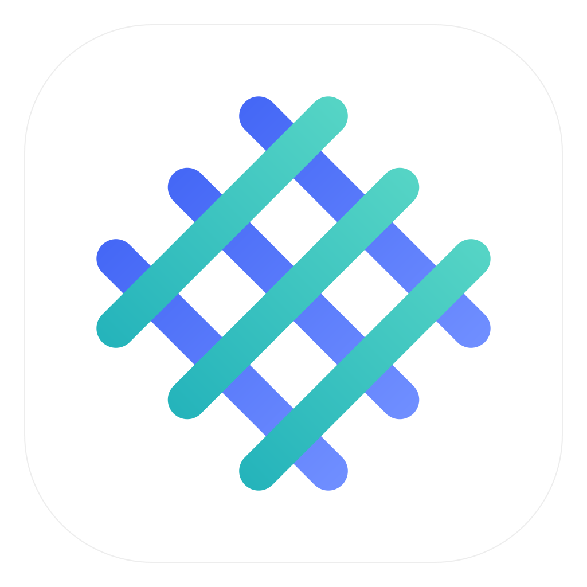
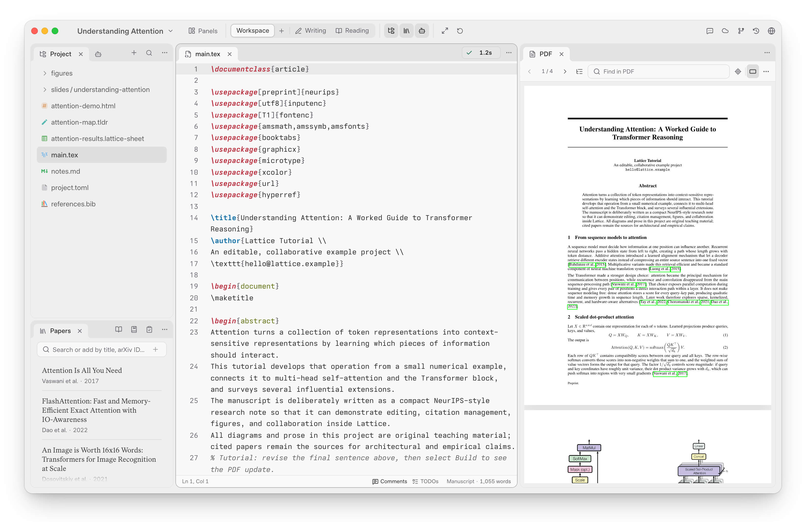

<h1>Lattice</h1>

A local-first LaTeX workspace for macOS.

[Website](https://leo1oel.github.io/lattice/) · [Download](https://github.com/leo1oel/lattice/releases/latest) · [Docs](docs/README.md) · [Issues](https://github.com/leo1oel/lattice/issues)

  

Read more

## Features

- LaTeX completion, diagnostics, and SyncTeX navigation between source and PDF.
- Literature search, arXiv imports, and citation insertion.
- Markdown notes, whiteboards, diagrams, and spreadsheets.
- Comments, Git history, and Overleaf sync with shared cursors and chat.
- An AI agent that can read your papers, help with build errors, and make edits for you to review.

## Get started

Lattice runs on Apple Silicon Macs with macOS 14 or later.
Official builds are signed and notarized by Apple.

1. Open the [latest release](https://github.com/leo1oel/lattice/releases/latest) and download the `.dmg` under **Assets**, below the release notes.
2. Open the DMG and drag Lattice into Applications.
3. Launch Lattice and open a folder, choose a template, or connect an Overleaf project.

## Your files and privacy

Your project is a folder of ordinary files on your Mac, so you can use another editor or Git without exporting anything.
Keep `.research/` alongside your files to preserve imported papers and agent sessions.

## Contributing

Lattice uses Tauri 2, Rust, React, and TypeScript.
See [CONTRIBUTING.md](CONTRIBUTING.md) to build the app and run tests, or browse the [architecture docs](docs/README.md).
Bug reports and pull requests are welcome; please open an [issue](https://github.com/leo1oel/lattice/issues) before a large refactor.

## Acknowledgements

Lattice is built on the work of many open-source projects. The major ones:

- [Open Knowledge](https://github.com/inkeep/open-knowledge) (inkeep/open-knowledge) by Inkeep, the original basis of Lattice's earlier visual Markdown editor. Lattice has since replaced it with its own engine, but the editor began there, and we are grateful.
- [Trellis](https://github.com/DanFessler/trellis) by Dan Fessler, the dockable panel layout of Lattice's workspace. Uses Trellis by DanFessler - github.com/DanFessler/trellis.
- [Synara](https://github.com/Emanuele-web04/synara) by T3 Tools Inc. and Emanuele Di Pietro, the agent runtime behind Lattice's AI assistant.
- [Open Slide](https://github.com/open-slide/open-slide), which powers presentations.
- [Tiptap](https://github.com/ueberdosis/tiptap) and [CodeMirror](https://codemirror.net/), the rich-text and source editors.
- [PDF.js](https://github.com/mozilla/pdf.js), the PDF viewer.
- [Tauri](https://github.com/tauri-apps/tauri), the desktop shell.

## License

Lattice is licensed under the [Apache License 2.0](LICENSE) (see also [NOTICE](NOTICE)), with the MIT-licensed [Synara](https://github.com/Emanuele-web04/synara) agent runtime by T3 Tools Inc. and Emanuele Di Pietro.
Releases up to and including 0.1.341 were GPL-3.0-or-later and remain available under those terms.
See [third-party notices](THIRD_PARTY_NOTICES.md) for component licenses and [Synara integration notes](docs/synara-runtime.md) for the runtime details.

The whiteboard's tldraw SDK (`tldraw`, `@tldraw/editor`, `@tldraw/driver`) is not covered by the Apache License: it is source-available under the [tldraw license](public/licenses/tldraw-LICENSE.md), which requires a license key for production use.
Official builds supply that key at build time; it is not in this repository, so a build without it runs tldraw in its watermarked mode.

The workspace's panel layout, `@danfessler/trellis` (with `@danfessler/trellis-react`), is licensed under its own non-commercial license (with a commercial tier), not Apache-2.0: see [its license](public/licenses/trellis-LICENSE.md), the [non-commercial terms](public/licenses/trellis-LICENSE-NONCOMMERCIAL.md) and the [commercial terms](public/licenses/trellis-LICENSE-COMMERCIAL.md).
Those terms apply to anyone using Lattice: the free tier covers non-commercial use only, so use at a company or a for-profit organization needs a Trellis license from its author.
Uses Trellis by DanFessler - github.com/DanFessler/trellis.

