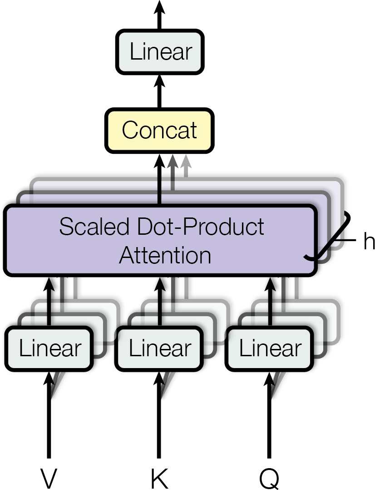

# Understanding Attention

How Transformers decide what information matters

Notes:
Open by connecting this short talk to the manuscript, notes, experiment table, and figures in the same Lattice project.

---

## One operation, three roles

- **Queries** express what each position is looking for.
- **Keys** describe what each position can match.
- **Values** carry the information that gets combined.

The softmax of scaled query–key scores determines how much of each value reaches the output.

---

## Multiple heads capture different relations

Each head learns its own projections, attends independently, and contributes to the final representation.

Notes:
Use the figure to distinguish parallel attention heads from successive model layers.

---

## More heads change the trade-off

| Configuration | Accuracy | Latency |
| --- | ---: | ---: |
| Baseline | 76.4% | 12.8 ms |
| Two heads | 77.2% | 13.1 ms |
| Four heads | 78.6% | 13.7 ms |
| Eight heads | 79.1% | 14.4 ms |

The tutorial spreadsheet contains these illustrative values and formulas for exploring them.

---

## Attention is useful evidence, not a complete explanation

> Attention weights show where information is routed, but they do not establish causality on their own.

Compare attention patterns with ablations, value vectors, residual-stream analysis, and task-level behavior.

Notes:
End on the methodological limitation rather than implying that an attention map fully explains a model prediction.
