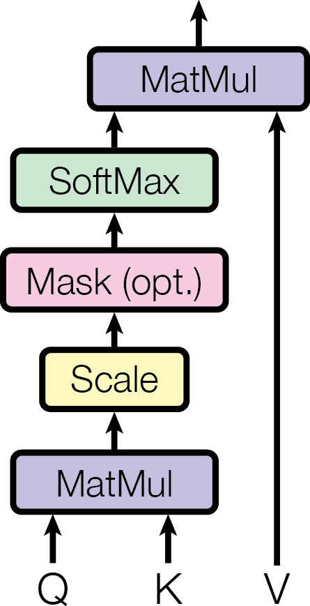
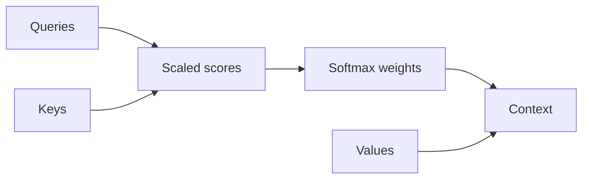

# Markdown component gallery

This document demonstrates the Markdown text styles, blocks, media, math, diagrams, and interactive embeds available in Lattice.
Edit the source on the left or work directly with the formatted document on the right.
Select a block and use its `+` button to browse the complete insertion catalog.

## Headings, rich text, and links

### Inline formatting

Combine **strong emphasis**, *italics*, ***bold italics***, ~~revisions~~, `inline code`, and a [link to the original paper](https://arxiv.org/abs/1706.03762) in ordinary prose.
Inline math such as $d_k=64$ and $QK^\top$ stays editable while retaining its LaTeX source.
An escaped character such as \* remains literal, and an emoji such as 🧭 can sit beside regular text.

> Attention is a routing mechanism: each output combines values according to query–key compatibility.
>
> A block quote can contain more than one paragraph when an explanation needs context.

---

## Callout and accordion

<Callout type="important" title="Attention maps need validation">
Attention weights show routing patterns, but they do not establish causality. Compare them with ablations or attribution methods before drawing a conclusion.
</Callout>

The surrounding explanation remains ordinary Markdown, so it stays easy to scan and edit.
The accordion is only a compact optional aside:

<Accordion title="Why scale attention scores?" defaultOpen>
Scaling keeps the softmax distribution and its gradients well behaved.
</Accordion>

## Lists and tasks

Unordered lists work well for parallel ideas:

- Queries describe what each position is looking for.
- Keys describe what each position can match.
- Values carry the information that gets combined.
  - A nested item can add detail without starting a new section.
  - Another nested item keeps related evidence grouped.

Numbered lists make a sequence explicit:

1. Compute scaled query–key scores.
2. Normalize the scores with softmax.
3. Combine the value vectors using those weights.

Task lists keep research work actionable:

- [x] Add the original Transformer paper.
- [x] Check the dimensions in the attention equation.
- [ ] Compare the explanation with the interactive HTML demo.

## Tables and inline math

| Component | Shape | Purpose |
| --- | --- | --- |
| Queries | $n \times d_k$ | Express what each token seeks |
| Keys | $n \times d_k$ | Provide matching features |
| Values | $n \times d_v$ | Carry information to aggregate |
| Scores | $n \times n$ | Compare every query with every key |

The Shape column uses inline math rather than code formatting, so subscripts and operators render correctly.

## Display math

The visual editor renders display math while preserving the underlying Markdown source.

$$
\operatorname{Attention}(Q,K,V)=\operatorname{softmax}\left(\frac{QK^\top}{\sqrt{d_k}}\right)V
$$

## Code block

Fenced code blocks preserve indentation, expose their language, and support syntax highlighting.
This example implements the complete scaled dot-product operation rather than only listing its three equations.

```python title="Scaled dot-product attention in NumPy"
import numpy as np

def softmax(values: np.ndarray, axis: int = -1) -> np.ndarray:
    shifted = values - values.max(axis=axis, keepdims=True)
    exponentials = np.exp(shifted)
    return exponentials / exponentials.sum(axis=axis, keepdims=True)

def scaled_dot_product_attention(
    queries: np.ndarray,
    keys: np.ndarray,
    values: np.ndarray,
    mask: np.ndarray | None = None,
) -> tuple[np.ndarray, np.ndarray]:
    key_dimension = keys.shape[-1]
    scores = queries @ keys.swapaxes(-1, -2) / np.sqrt(key_dimension)
    if mask is not None:
        scores = np.where(mask, scores, -np.inf)
    weights = softmax(scores, axis=-1)
    context = weights @ values
    return context, weights
```

## Figure



## Diagram



## Embedded HTML

An `html preview` fence runs HTML, CSS, and JavaScript in a sandboxed inline frame.
Use the buttons in this compact attention demo, then open [attention-demo.html](attention-demo.html) for the full project-sized visualization shown in the next tutorial step.

```html preview h=360px title="Embedded attention demo"
<!doctype html>
<html lang="en">
<head>
  <meta charset="utf-8">
  <style>
    :root { color-scheme: light dark; font-family: system-ui, sans-serif; }
    body { margin: 0; padding: 24px; background: Canvas; color: CanvasText; }
    .tokens { display: flex; flex-wrap: wrap; gap: 8px; }
    button { padding: 8px 12px; border: 1px solid color-mix(in srgb, CanvasText 18%, Canvas); border-radius: 9px; background: Canvas; color: inherit; }
    button[aria-pressed="true"] { border-color: #6757d9; background: #6757d9; color: white; }
    .bars { display: grid; gap: 8px; margin-top: 20px; }
    .bar { display: grid; grid-template-columns: 76px 1fr 42px; gap: 10px; align-items: center; }
    .track { height: 9px; overflow: hidden; border-radius: 99px; background: color-mix(in srgb, CanvasText 10%, Canvas); }
    .fill { height: 100%; border-radius: inherit; background: #6757d9; transition: width 160ms ease-out; }
  </style>
</head>
<body>
  <strong>Select a query token</strong>
  <p>The bars show its illustrative attention distribution.</p>
  <div class="tokens" aria-label="Query token"></div>
  <div class="bars" aria-live="polite"></div>
  <script>
    const tokens = ["attention", "connects", "every", "position"];
    const rows = [
      [0.58, 0.24, 0.12, 0.06],
      [0.14, 0.50, 0.11, 0.25],
      [0.08, 0.17, 0.48, 0.27],
      [0.06, 0.16, 0.29, 0.49]
    ];
    const buttons = document.querySelector(".tokens");
    const bars = document.querySelector(".bars");

    function render(selected) {
      buttons.innerHTML = tokens.map((token, index) =>
        `<button aria-pressed="${index === selected}" data-index="${index}">${token}</button>`
      ).join("");
      bars.innerHTML = rows[selected].map((weight, index) => `
        <div class="bar">
          <span>${tokens[index]}</span>
          <div class="track"><div class="fill" style="width:${weight * 100}%"></div></div>
          <output>${weight.toFixed(2)}</output>
        </div>`).join("");
      buttons.querySelectorAll("button").forEach(button =>
        button.addEventListener("click", () => render(Number(button.dataset.index)))
      );
    }

    render(1);
  </script>
</body>
</html>
```

## Footnotes

Footnotes keep supporting context close without overloading the main paragraph.[^components]

[^components]: Type `/` on an empty line to browse everything that can be inserted.
