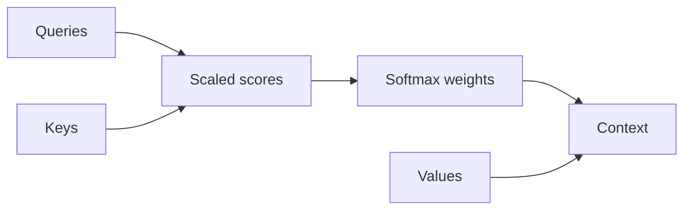

# Markdown component gallery

This document demonstrates the Markdown blocks available in Lattice.
Edit the source on the left or work directly with the formatted document on the right.
Select a block and use its `+` button to browse the complete insertion catalog.

## Rich text and links

Combine **strong emphasis**, *italics*, ~~revisions~~, `inline code`, and a [link to the original paper](https://arxiv.org/abs/1706.03762) in ordinary prose.

> Attention is a routing mechanism: each output combines values according to query–key compatibility.

## Lists and tasks

Unordered lists work well for parallel ideas:

- Queries describe what each position is looking for.
- Keys describe what each position can match.
- Values carry the information that gets combined.

Numbered lists make a sequence explicit:

1. Compute scaled query–key scores.
2. Normalize the scores with softmax.
3. Combine the value vectors using those weights.

Task lists keep research work actionable:

- [x] Add the original Transformer paper.
- [x] Check the dimensions in the attention equation.
- [ ] Compare the explanation with the interactive HTML demo.

## Table

| Component | Shape | Purpose |
| --- | --- | --- |
| Queries | `n × d_k` | Express what each token seeks |
| Keys | `n × d_k` | Provide matching features |
| Values | `n × d_v` | Carry information to aggregate |

## Equation

The visual editor renders display math while preserving the underlying Markdown source.

$$
\operatorname{Attention}(Q,K,V)=\operatorname{softmax}\left(\frac{QK^\top}{\sqrt{d_k}}\right)V
$$

## Code

```python
scores = queries @ keys.T / sqrt(key_dimension)
weights = softmax(scores, axis=-1)
context = weights @ values
```

## Figure


## Diagram



The same editor also supports headings, lists, tasks, tables, citations, footnotes, embeds, and registered project components.[^components]

[^components]: Type `/` on an empty line to browse everything that can be inserted.
